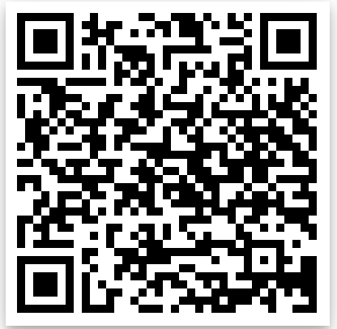

Download the guerrilla grafters app to track your grafts using RFID and NFC on android phones.
A lot more work could be done to make this code lighter. We welcome development!

## What does it do?
This app allows you read and write NFC/ RFID tags embedded in the tree to track your grafts. It records the species and varietal as well as date and approximate location of the graft. We use the app and the code book

## What is required?
At the moment this app only works on android due to limitations on using nfc on iOS. If you know how to get this working, please let us know.  To run this app you only need a recent (but not new) android phone.  Galaxy S4 works great. The phone needs to have NFC capability, but does not need a sim card. 
__NOTE: During the installation You need to change your phone’s security settings to allow for unsigned apps__

## How do I get the App?
1. Click [THIS LINK](https://github.com/guerrillagrafters/app/blob/master/GuerrillaGrafterApp.apk?raw=true) to download the RAW code and install the app.  
 ___or___
 scan this qr code to down load the app to your android.

2. Click [THIS LINK](http://beforebefore.net/GG_code_bookv2.pdf) to download the corresponding Super Secret code book to encode and decode your grafters notes. 
 

